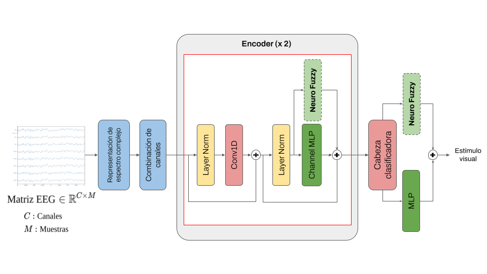

# FuzzySSVEPformer

This project is the code implementation of "FUZZY-SSVEPFORMER: CLASIFICACIÓN DE POTENCIALES EVOCADOS VISUALES POR ARQUITECTURA NEURO-FUZZY TRANSFORMER" bachelor thesis by Marcelo Contreras (UTEC).

## Features
* Deep Neuro-Fuzzy block (FuzzyType 1 & 2)
* Customized dataloader for Nakanishi and Benchmark SSVEP datasets
* Clean implementation of SSVEPFormer ([Chen et.al, 2022](https://arxiv.org/abs/2210.04172)) 

## Requirements
* Python 3.8+
* pytorch
* torchvision
* torch 
* scipy

## Model overview

From the base model, three variants (A,B and C) were proposed where the location of neuro-fuzzy block is changed between encoder and classification head.

## Usage

You have to provide a params file for each dataset that contains arguments of filtering options and dataset features. 

Available model parsers are: 

`'ssvepformer', 'f1ssvepformer_A', 'f1ssvepformer_B','f1ssvepformer_C','f2ssvepformer_A', 'f2ssvepformer_B','f2ssvepformer_C'`

**To train specified model with saving results (only report in .csv)**

`python main.py --model ssvepformer --dataset 'NAKANISHI' --signal_size 0.5 --data_path 'datasets/2015_Nakanishi_SSVEP_database' --params_path 'datasets/Nakanishi.yaml' 
`  

